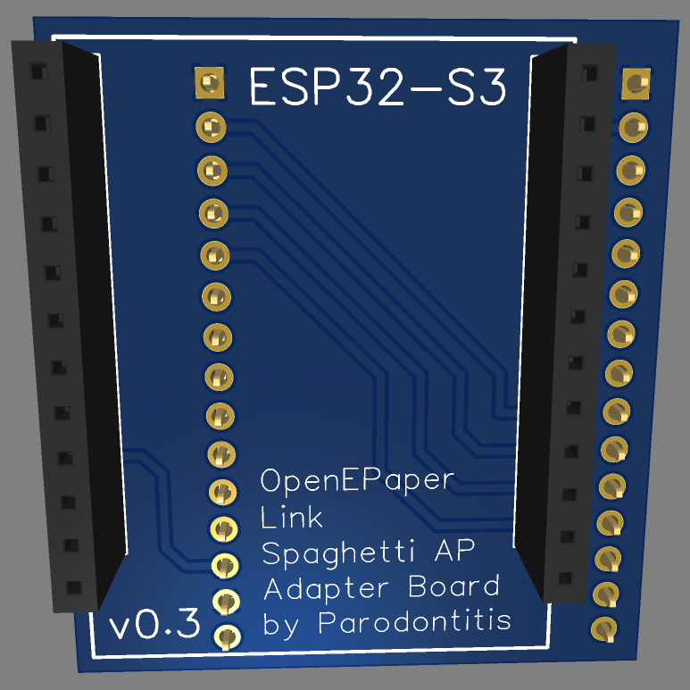
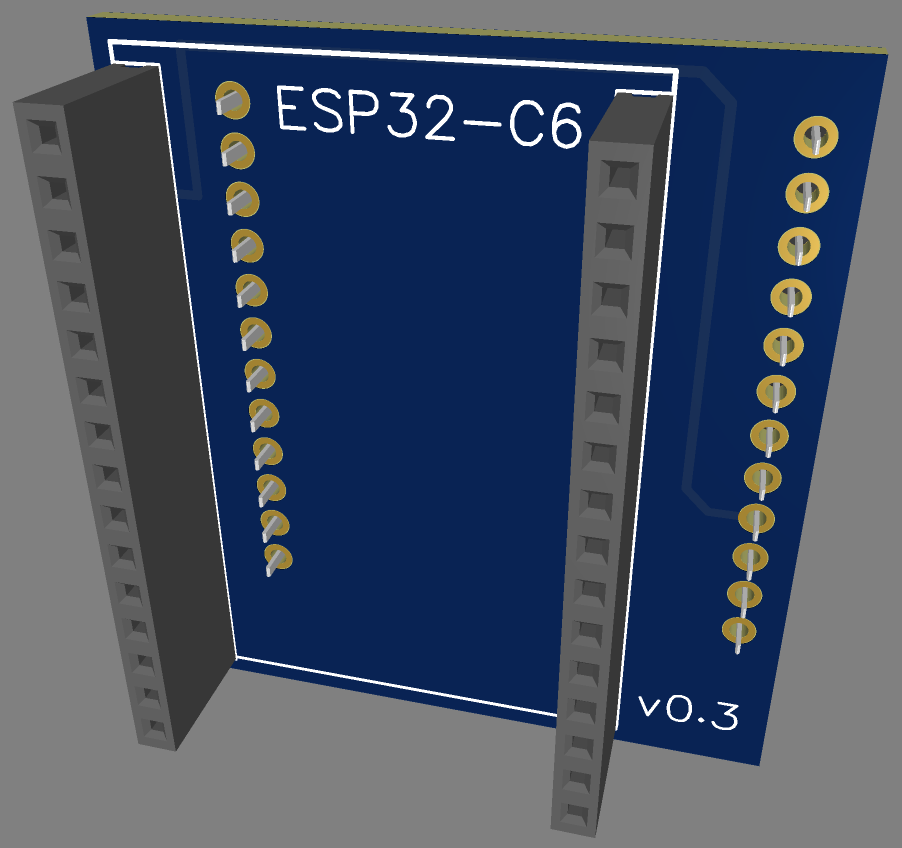
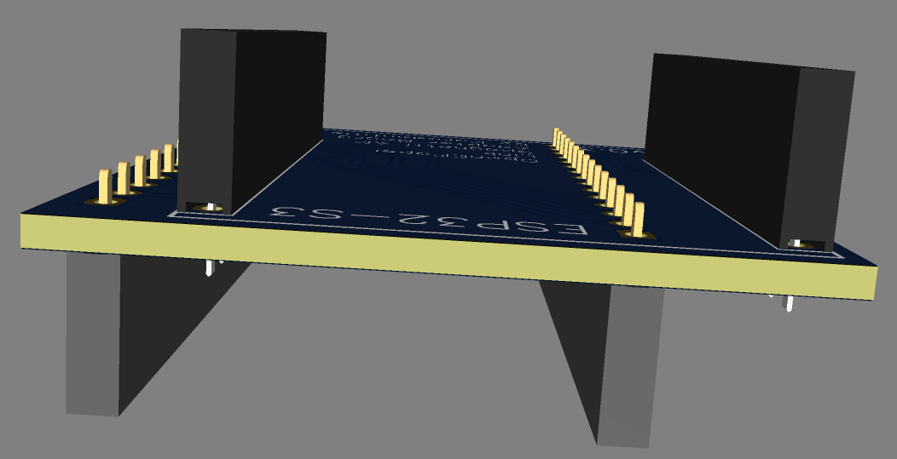
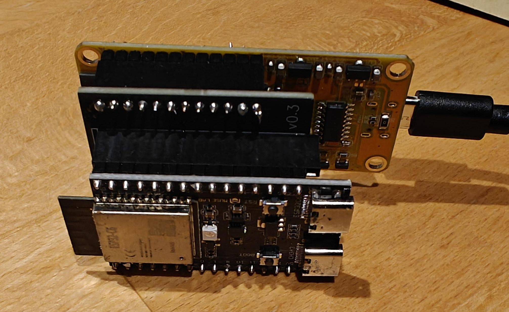
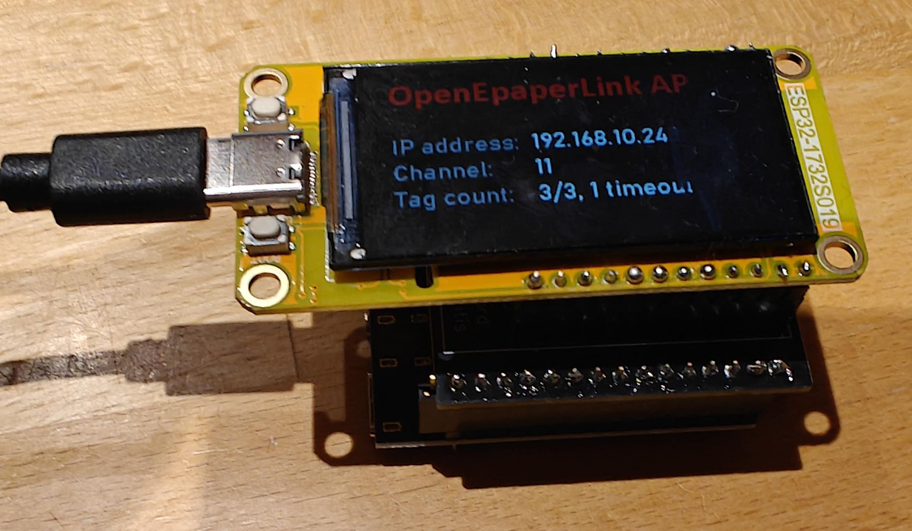
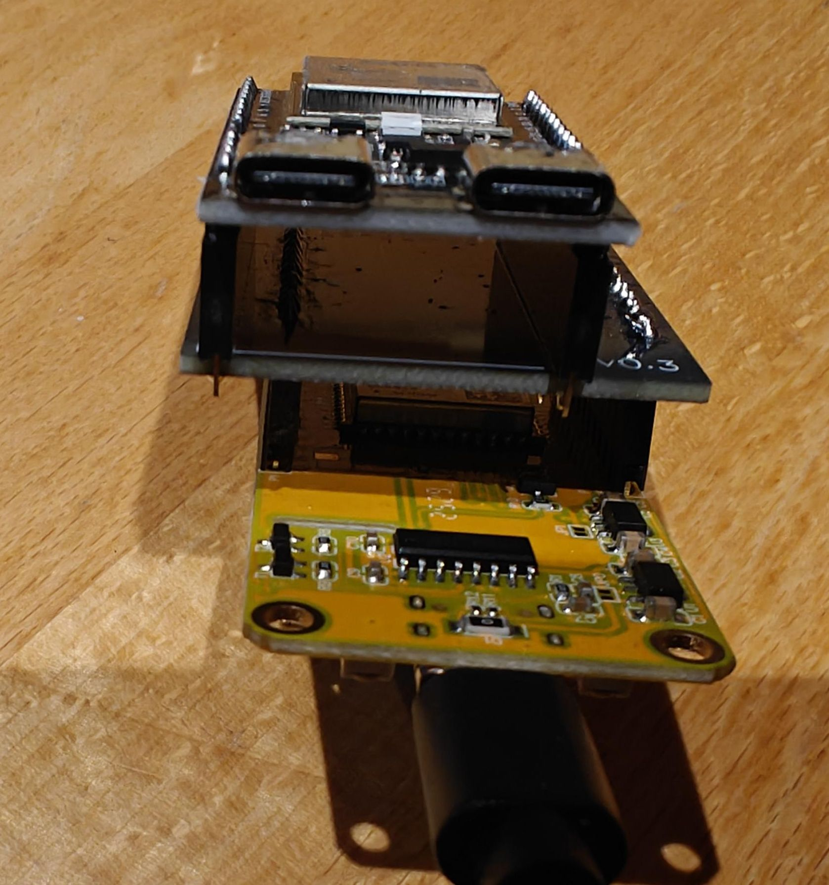

# Description

Simple adapter bord for the Spaghetti AP with ESP32-C6 and ESP32-S3 for the [OpenEPaperLink Project](https://github.com/OpenEPaperLink/OpenEPaperLink/wiki/Beginners-Guide-for-an-easy-to-build-Access-Point-(aka-spaghetti-AP)).

## PCB production
You can simply use the Gerber-file to have your own PCB produced.

## Further steps
As soon as I find some time, I will create a suitable case for 3D printing.
If anyone is faster than me, I would be very grateful for their support.

## Images

    
     
     

     
     
     

